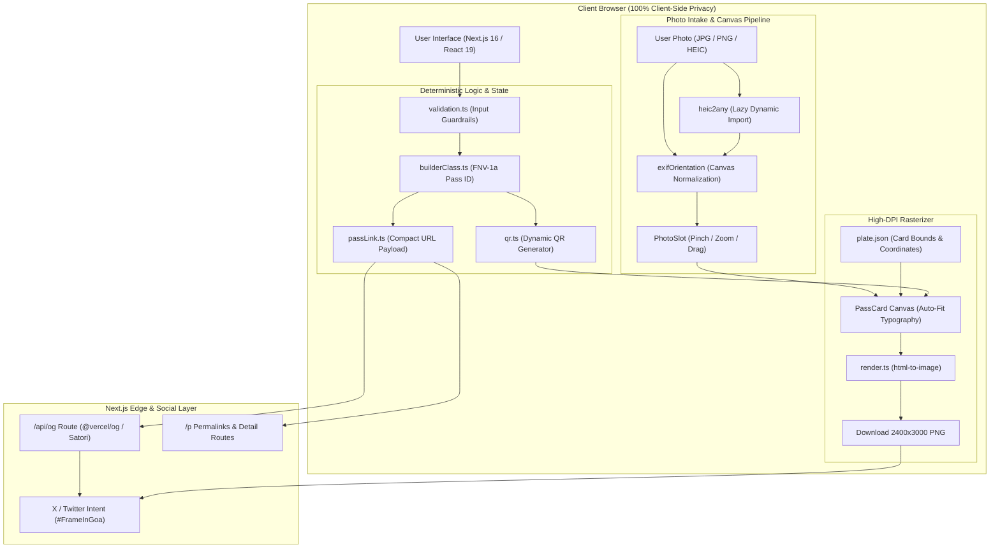

# 🌴 HH Goa 2026 — Builder Pass Generator

> **Mint your official Hacker House Goa 2026 Builder Badge in seconds.**  
> Upload your photo, customize your builder profile, download a high-res printable PNG badge, and share your pass to X with `#FrameInGoa`.

## ✨ Features

- 🔒 **100% Client-Side Privacy**: Photos and personal details never leave your browser. All image processing, EXIF normalization, and badge rendering occur locally on client-side canvases.
- 📸 **Smart Photo Intake & Crop Tooling**:
  - Full support for `JPG`, `PNG`, and `HEIC` (iPhone live photo format) images.
  - Interactive crop adjustment with zoom, drag, pan, scale, and offset controls.
  - Automatic EXIF orientation parsing to eliminate sideways iPhone uploads.
  - On-demand dynamic loading of `heic2any` to keep initial bundle size minimal.
- 🎯 **Auto-Scaling Canvas Typography**: Real-time canvas measurement auto-scales names and details to fit seamlessly without text overflowing the card artwork bounds.
- 🆔 **Deterministic Builder ID**: Generates a unique, reproducible Pass ID (`HHG26-<INITIALS>-<HASH>`) computed via FNV-1a hashing of the builder's name and X handle.
- 📲 **Real-Time Dynamic QR Code**: Embeds a live QR code onto the badge encoding the pass's permalink (`/p?...`), verified with automated decoder validation.
- 🖼️ **Ultra-HD High-Resolution Export**: Exports crisp **2400×3000px PNG badges** (2× Retina scale of the 1200×1500px layout canvas) using `html-to-image`.
- 🌐 **Dynamic OpenGraph Link Previews**: Serves custom edge-rendered social preview cards via `/api/og` powered by `@vercel/og` (Satori) and compact URL state decoding.
- ⚡ **Performance & UX First**:
  - Smooth desktop hero backdrop and video intro modal.
  - Adaptive media loading (videos excluded on mobile connections to conserve data).
  - Built-in form validation with character limits and instant error feedback.
  - One-click X (Twitter) intent sharing pre-filled with `#FrameInGoa` caption.

---

## 🏗️ System Architecture

The application is built with a **Client-First Architecture** ensuring complete privacy. All image manipulation, orientation correction, canvas layout calculations, and rasterization take place locally in the user's browser. Server routes exist purely for dynamic social OpenGraph previews (`/api/og`) and permalink decoding (`/p`).



---

## 🛠 Tech Stack

| Layer | Tech / Tool | Description |
|---|---|---|
| **Framework** | [Next.js 16](https://nextjs.org/) | App Router, Server Components & Edge Routes |
| **UI Library** | [React 19](https://react.dev/) | Client state, dynamic canvas hooks, layout components |
| **Styling** | [Tailwind CSS v4](https://tailwindcss.com/) | Modern utility-first CSS with dark theme tokens |
| **Image Processing** | `heic2any`, dynamic canvas APIs | Client-side format conversion & EXIF parsing |
| **Badge Rendering** | `html-to-image` | High-DPI DOM-to-PNG rasterization |
| **QR Code** | `qrcode` & `jsqr` | Deterministic URL encoding and validation |
| **Social / OG** | `@vercel/og` (Satori) | Dynamic OpenGraph image edge function |
| **Language** | [TypeScript 5](https://www.typescriptlang.org/) | Strict static typing across components & utilities |

---

## 📂 Project Structure

```
hhgoa-pass/
├── public/                  # Static assets (plate PNGs, video, logos)
├── scripts/
│   └── build-plate.mjs      # Design artwork processing & coordinate extractor
├── src/
│   ├── app/
│   │   ├── api/og/          # Dynamic OpenGraph image generation route
│   │   ├── p/               # Pass permalink viewer & detail page
│   │   ├── globals.css      # Design tokens & animation styles
│   │   ├── layout.tsx       # Root layout & font metadata
│   │   └── page.tsx         # Main interactive builder pass generator page
│   ├── components/
│   │   ├── CoconutIsland.tsx# Easter egg dynamic canvas animation
│   │   ├── HeroBackdrop.tsx # Interactive desktop video backdrop
│   │   ├── Intro.tsx        # Motion intro splash overlay
│   │   ├── PassCard.tsx     # Core badge component with dynamic text placement
│   │   ├── PhotoSlot.tsx    # Interactive photo viewport & crop container
│   │   ├── PhotoTools.tsx   # Zoom & pan adjustment controls
│   │   ├── ScaledCard.tsx   # Responsive badge container wrapper
│   │   └── marks.tsx        # Vector icons and SVG branding assets
│   └── lib/
│       ├── builderClass.ts  # Deterministic Pass ID hashing algorithm
│       ├── passLink.ts      # URL encoding/decoding for shareable permalinks
│       ├── photo.ts         # Photo intake, HEIC conversion & EXIF handling
│       ├── plate.json       # Extracted card geometry coordinates
│       ├── qr.ts            # QR code generation helper
│       ├── render.ts        # PNG export & download engine
│       ├── siteUrl.ts       # Absolute URL resolution helper
│       └── validation.ts    # Character limits & input validation logic
├── package.json
└── tsconfig.json
```

---

## 🚀 Getting Started

### Prerequisites

- **Node.js**: v18.0.0 or higher
- **npm**: v9.0.0 or higher

### Local Development

1. **Clone the repository and install dependencies**:
   ```bash
   git clone https://github.com/Karannnnn614/hhgoa-pass.git
   cd hhgoa-pass
   npm install
   ```

2. **Run the development server**:
   ```bash
   npm run dev
   ```

3. **Open the app**:
   Navigate to [http://localhost:3000](http://localhost:3000) in your browser.

---

## 🌐 Deployment (Vercel)

Deploy instantly with Vercel CLI:

```bash
npx vercel --prod
```

### Environment Variables

Configure the primary site URL in your Vercel Project Settings so OpenGraph previews resolve correctly on X / Twitter:

```env
NEXT_PUBLIC_SITE_URL=https://your-deployment.vercel.app
```

> ⚠️ **Note**: Without `NEXT_PUBLIC_SITE_URL`, metadata defaults to `http://localhost:3000`, causing X / Twitter link previews to fall back to default assets.

---

## 🎨 Plate Generation Script

The pass layout uses `public/plate.png` as its foundational badge artwork. If the original design mockup updates, you can re-run the automated geometry extractor:

```bash
node scripts/build-plate.mjs
```

**What it does:**
1. Detects card body bounds from the source mockup.
2. Punches out the photo viewport circle.
3. Erases placeholder text and crops unnecessary border padding.
4. Generates `src/lib/plate.json` containing exact pixel offsets for live text and photo placement.

---

## 🧪 Quality & Integrity Checks

- **Deterministic Hash Integrity**: `src/lib/builderClass.ts` includes runtime assertions ensuring pass IDs remain case-insensitive, whitespace-trimmed, and reproducible across sessions.
- **Layout & Typography Resilience**: Tested against varied name lengths (from single characters to long multi-word names like "Rajesh Kumaraswamy") to verify auto-scaling canvas typography.
- **QR Code Verification**: QR code payloads are verified by decoding generated PNG outputs with `jsqr` to ensure valid permalink resolution.

---

## 📜 License

Created for **Hacker House Goa 2026**. Built with ❤️ for the builder community.

